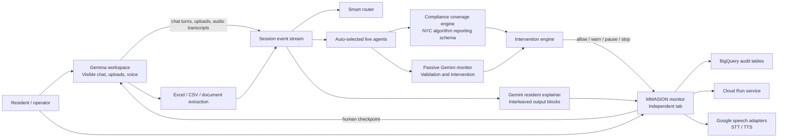

# Architecture

## Main Surfaces

- `/gemma`
  - visible worker UI
  - Gemma 12B via Ollama
  - file uploads
  - voice input/output hooks
- `/`
  - MMASION supervision console
  - resident explainer generation
  - intervention review
  - session analytics

## Two Agent Layers

MMASION should be presented as two different agent layers working together.

### Domain agents

These are the workers that do the task itself:

- `Finance Agent`
- `Operations Agent`
- `Legal Agent`
- `IT Agent`
- `HR Agent`
- `Healthcare Agent`
- `General Agent`

### Monitor agents

These are MMASION's internal supervision roles:

- `Conversation Monitor`
- `Evidence Scope Agent`
- `Action Guard`
- `Document Intake Agent`
- `Vendor Risk Agent`
- `Data Governance Agent`
- `Voice Supervisor`
- `Human Checkpoint Agent`
- `Policy Counsel Agent`

Simple rule:

- domain agents do the work
- monitor agents decide whether the work should be trusted

## Suggested Routing Map

| Need | Domain agent | Monitor agents |
| --- | --- | --- |
| Finance spreadsheet analysis | `Finance Agent` | `Document Intake Agent`, `Evidence Scope Agent`, `Action Guard` |
| Contract or policy interpretation | `Legal Agent` | `Policy Counsel Agent`, `Action Guard` |
| System or architecture task | `IT Agent` | `Evidence Scope Agent`, `Action Guard` |
| Employee or workplace workflow | `HR Agent` | `Action Guard`, `Human Checkpoint Agent` |
| Healthcare or sensitive patient workflow | `Healthcare Agent` | `Data Governance Agent`, `Action Guard` |
| Workflow/process question | `Operations Agent` | `Conversation Monitor`, `Action Guard` |
| Low-confidence intake | `General Agent` | `Conversation Monitor` |

## NYC Field Ownership

For the NYC-style transparency workflow, this is the clean field mapping:

| Field group | Main domain agent | Main monitor agents |
| --- | --- | --- |
| Agency, purpose, population | `Operations Agent` or `Legal Agent` | `Conversation Monitor`, `Policy Counsel Agent` |
| Tool name, tool description, computation type | `IT Agent` | `Document Intake Agent`, `Conversation Monitor` |
| Training/input/output/identifying info | `IT Agent`, `Healthcare Agent`, or `Legal Agent` depending on context | `Data Governance Agent`, `Policy Counsel Agent` |
| Vendor name and vendor role | `Finance Agent` or `Legal Agent` | `Vendor Risk Agent` |
| Update history | `IT Agent` or `Operations Agent` | `Document Intake Agent`, `Conversation Monitor` |

## Google-Native Runtime Path

- Gemini API / Vertex AI
  - passive monitor
  - resident explainer
  - future multimodal interleaving
- Speech-to-Text / Text-to-Speech
  - audio transcription and playback
- BigQuery
  - event telemetry and audit analytics
- Cloud Run
  - public demo deployment target

## Current Local-First Runtime

- Gemma worker: local Ollama
- Monitor: Gemini API when configured, deterministic fallback otherwise
- Storage: local JSON stores for runs and sessions
- Upload extraction: server-side spreadsheet and text parsing
