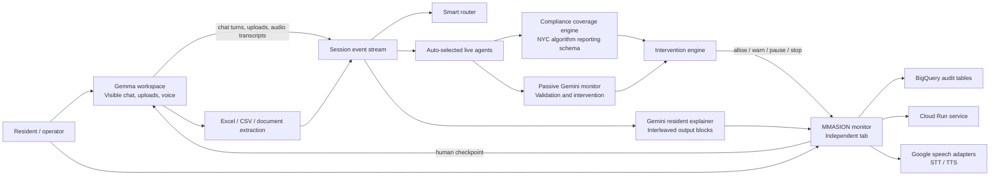

# Architecture

## Main Surfaces

- `/gemma`
  - visible worker UI
  - Gemma 12B via Ollama
  - file uploads
  - voice input/output hooks
- `/`
  - MMASION supervision console
  - resident explainer generation
  - intervention review
  - session analytics

## Google-Native Runtime Path

- Gemini API / Vertex AI
  - passive monitor
  - resident explainer
  - future multimodal interleaving
- Speech-to-Text / Text-to-Speech
  - audio transcription and playback
- BigQuery
  - event telemetry and audit analytics
- Cloud Run
  - public demo deployment target

## Current Local-First Runtime

- Gemma worker: local Ollama
- Monitor: Gemini API when configured, deterministic fallback otherwise
- Storage: local JSON stores for runs and sessions
- Upload extraction: server-side spreadsheet and text parsing
